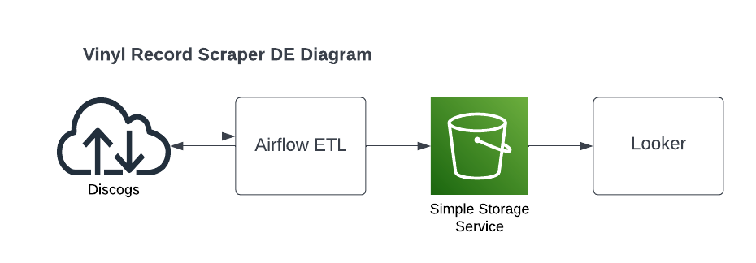

# Airflow Recrod Scraper



## Running Airflow

[Running Airflow in Docker](<https://airflow.apache.org/docs/apache-airflow/stable/start/docker.html>) 

Default username and password will be "airflow"

```sh
# Initialize database
docker-compose up airflow-init

# Start
docker-compose up
```

## Dags

### Find Vinyl Records For Sale

*Currently a script and **not** a dag*

1. Visit [Discogs.com](<https://www.discogs.com/>) and search for the Artist to find available records for
2. Go to the artist Discogs webpage and their URL should look similar to this "https://www.discogs.com/artist/119485-Tatsuro-Yamashita"
3. Copy the value after "...artist/" (119485-Tatsuro-Yamashita for example) and update the ARTIST vairalbe on line 11 in the `get_vinyl_records_script.py` file
4. Run the script with `python dags/get_vinyl_records_script.py`
5. The script will then output a csv file in the exports folder

*There may be bugs when running this script*

## Visualization

[Tatsuro Yamashita Records - Google Datastudio Dashboard](<https://datastudio.google.com/s/oLZB7VpfvzE>)

## Cleanup

[Full cleanup instructions](<https://airflow.apache.org/docs/apache-airflow/stable/start/docker.html#cleaning-up-the-environment>)

```sh
docker-compose down --volumes --remove-orphans
```